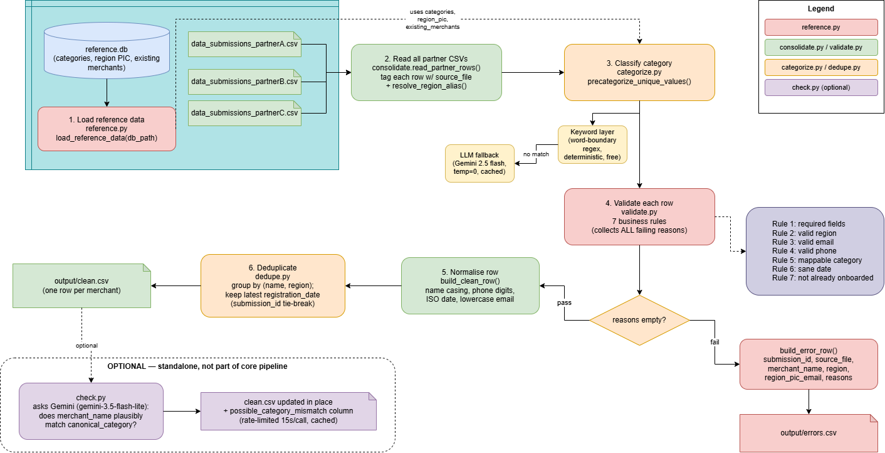

# Merchant Onboarding Automation

Replaces the manual weekly review of partner merchant submissions with an automated pipeline that validates, normalises, categorises, and deduplicates submissions from multiple partners, producing a ready-to-onboard list and a routed error report.

## Quick start

```bash
pip install -r requirements.txt

# optional for llm classification
echo "GOOGLE_API_KEY=your-key-here" > .env

python consolidate.py --data-dir data --db reference.db --out-dir output
```

Outputs are written to `output/clean.csv` and `output/errors.csv`.

Flags:
- `--data-dir`: folder containing `submissions_partner*.csv` (default: `data`)
- `--db`: path to `reference.db` (default: `reference.db`)
- `--out-dir`: output folder (default: `output`)
- `--no-llm`: skip the llm fallback or categorization

## Workflow Structure


```
consolidate.py          orchestrates the pipeline, writes clean.csv / errors.csv
process/
  reference.py           loads categories, region→PIC map, existing merchants from reference.db (SQL)
  validate.py             normalisation helpers + the 7 business rules
  categorize.py            keyword + LLM hybrid classifier for business_category_freetext
  dedupe.py                collapses duplicate submissions within a run
check.py   (optional - NOT part of the core pipeline)
```

Each module has a `__main__` self-check block **(example)** :
```bash
python -m process.validate 
```
with hand-written assertions testing each module.

## Pipeline

1. **Load reference data** (`reference.py`) - categories, region→PIC email
   map, and already-onboarded merchants, all read from `reference.db` via
   SQL. Nothing hardcoded.
2. **Read all partner CSVs** into one in-memory list, tagging each row with
   its source file for traceability.
3. **Classify** `business_category_freetext` (`categorize.py`).
4. **Validate** each row (`validate.py`) against the 7 rules in
   `DATA_DICTIONARY.md`. A row can fail multiple rules at once; all reasons
   are collected, not just the first.
5. **Normalise** rows that pass - consistent name casing, phone digits,
   ISO dates, lowercased emails.
6. **Deduplicate** (`dedupe.py`) the surviving rows.
7. **Write outputs** - `clean.csv` (one row per merchant, ready to onboard)
   and `errors.csv` (every rejected row, with a human-readable reason).

## Categorization

`business_category_freetext` is free text (`"nasi lemak stall"`, `"mini
grocer"`, etc.) that must map one canonical category from
`reference.db`. This is solved as a **two-tier hybrid**:

1. **Keyword layer (first, free, deterministic).** A curated
   `category → [keywords]` dict resolves the large majority of common
   phrasing (`"kopitiam"` → Food & Beverage, `"phone repair"` → Electronics
   & Repair, etc.). If a value matches keywords from more than one category,
   it's treated as ambiguous, not guessed.
2. **LLM fallback (only for what the keyword layer can't resolve).** Unmatched
   values are sent to Gemini (`gemini-3.5-flash-lite`, temperature 0)
   to reply with exactly one of the canonical category names or `NONE`.

**Why this scales:**: classification runs once per unique free-text value, with results cached. Only genuinely ambiguous values reach the LLM, keeping cost and latency roughly flat as volume grows. Values that fit neither tier are rejected (rule 5) rather than guessed.

Run `python -m process.categorize` to see the keyword-layer self-checks

**Fixed: substring false-positives in keyword matching.**: replaced raw keyword in text matching with word-boundary regex (\bkeyword\b). This prevents false matches like "smart home solutions" being classified as Grocery & Convenience because "mart" appears inside "smart".

## Deduplication

The same merchant can be submitted more than once, sometimes by different partners, sometimes with different casing/whitespace. Rows are grouped by
**normalised name + region**, and the row with the **latest `registration_date`** is kept, with a `duplicates_collapsed` count on the surviving row.
(**explained below**)


**Winner rule**: latest registration_date, not lowest submission_id. Partner data showed that submission_id is not chronological, even within a partner. Since newer duplicate submissions may contain corrections, the latest registration_date is treated as more trustworthy. submission_id is used only as a deterministic tie-breaker when dates are identical. This assumes registration_date is already normalised to ISO YYYY-MM-DD before deduplication.

**note** : when viewing, the date format will be switched to your operating system's default date/time format.


This only compares **new submissions against each other**  it does not defy rule 7 and lives in `validate.py` (using `reference.py`'s existing-merchant lookup) 
since that's a per-row reference lookup, not a cross-row comparison.


## Assumptions and judgement calls

- **Region aliasing.** The partner CSVs contain a handful of region values
  written as states/areas rather than canonical region names (`Penang`,
  `KL`, `Klang Valley`). `validate.py` maps these to their canonical region
  (`Northern`, `Central`, `Central`) before rule 2 runs, since geographically
  they're unambiguous. This is a deliberate deviation from a strict literal
  reading of rule 2 ("region is not one of the regions in `region_pic`") 
  the mapping is not sourced from `reference.db`, so it's a code-level
  assumption rather than a reference-data fact.

- **Merchant identity has no branch/location granularity.**
  `existing_merchants` only has `merchant_id` and `merchant_name`, no
  address or branch field, so "already onboarded" (rule 7) is necessarily
  name/ID-based only.

- **Observed anomaly, not auto-corrected:** submission `A004`
  ("Kedai Emas Trading", `existing_merchant_id = M0005`) lists
  `business_category_freetext = "computer shop"`, despite the merchant name
  suggesting a goldsmith/pawn business. This pattern (name apparently
  inconsistent with stated category) recurs in a handful of other rows too.
  The core pipeline does not cross-check merchant name against category.
  Rather than inventing an unvalidated heuristic inside
  `consolidate.py` to "fix?" this, it's handled by a separate, clearly
  out-of-band tool [Category mismatch review](#category-mismatch-review-optional)
  below and flagged here as a data-quality concern for Ops to verify with
  the partner.

- **Multiple rejection reasons per row.** A submission with several problems
  (e.g. bad phone *and* unmappable category) gets all its reasons listed in
  one `errors.csv` row (`;`-joined), rather than failing fast on the first
  issue so a partner can fix everything in one pass instead of resubmitting
  repeatedly.

## Category mismatch review (optional)

`check.py` is a **standalone tool, not part of the core
pipeline**. It was built after noticing rows like `A004` ("Kedai Emas
Trading" - "Gold Shop" in Malay tagged as `"computer shop"`), where the
merchant name looks inconsistent with its assigned canonical category.

Rather than folding a name/category consistency check into `consolidate.py`
itself, Claude's suggestion was to have this kept separate deliberately:
- DATA_DICTIONARY.md's 7 rules don't include a name/category consistency
  rule, adding one would be inventing a business rule, not implementing
  the spec.
- There's no ground truth to validate such a check against, it would need
  its own unvalidated heuristic (or a second LLM classifier) just to
  cross-check the first.
- This is exactly the kind of judgement call that should go back to a
  human, not be silently resolved by an algorithm.

**What it does:** reads `clean.csv`, asks an LLM (Gemini) whether each
`merchant_name` plausibly matches its `canonical_category`, and adds a
single `possible_category_mismatch` column **in place**, blank if the
name and category look consistent, otherwise a short reason. It does not
reject, reorder, or otherwise modify any row.


```bash
python check.py --input output/clean.csv
```

## AI usage

See `AI_REFLECTION.md` and the attached transcript(s) for how AI tools were
used throughout design discussion, code review, and the categorization
approach in particular.

## Recurring pipeline (stretch)

Below are my ideas on what would change to run this daily, unattended, with
concurrent triggers and possible mid-run crashes:

- **Idempotency / at-least-once safety.** Track processed `submission_id`s
  (or a content hash) in a small state store so re-running after a crash
  doesn't re-emit duplicate clean/error rows.
- **Atomic writes.** Write to temp files and rename on completion, so a
  crash mid-write never leaves a partially-written `clean.csv`/`errors.csv`.
- **Structured logging + alerting** on rejection-rate spikes, so a partner
  suddenly sending garbage data surfaces immediately rather than silently
  piling into `errors.csv`.
- **LLM call resilience** retries with backoff and a circuit breaker so a
  transient Gemini outage degrades to keyword-only mode instead of stalling
  the whole run.
